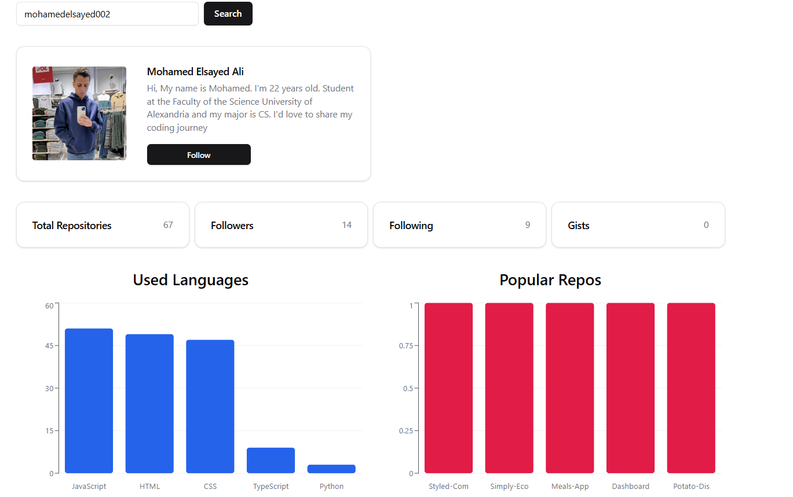

# GitHub User Search (Fully Tested) ✅

This project is a GitHub user search application built primarily to practice and demonstrate comprehensive testing. It allows users to enter a GitHub username and fetch detailed profile information, including repositories, followers, and language usage.
<br/> 



## Live Demo
Explore the app live <a href="https://github-search-testing.vercel.app/">Project</a>
<br/>
<hr/>

##  Installation & Setup Guide

### Clone the project  
```bash
git clone https://github.com/MohamedElsayed002/github-search-testing
```

###  Navigate to the project directory
```bash
cd github-user-search
```

### Install dependencies
```bash
npm install
```

### Start the development server
```bash
npm run dev 
```

### Start testing the project
```bash
npm run test
```
<hr/>

## About the Project
### This project is designed to test every aspect of the application, including: <br/>

`API calls` – Ensuring accurate data fetching using Vitest and MSW (Mock Service Worker) <br/>
`Components` – Unit and integration testing for UI elements using React Testing Library <br/>
`State Management` – Ensuring proper state updates and handling edge cases <br/>
`Error Handling` – Testing how the app behaves with incorrect usernames or API failures <br/>
<hr/>

## Features 
- Search for any GitHub user by username
- Display user profile details, including repositories and followers
- Charts for popular repositories and used programming languages
- Fully tested with Vitest and MSW
<hr/>

###  Tech Stack 🛠
- Frontend: React, Vite
- Testing: Vitest, MSW, React Testing Library
- Styling: Tailwind CSS
